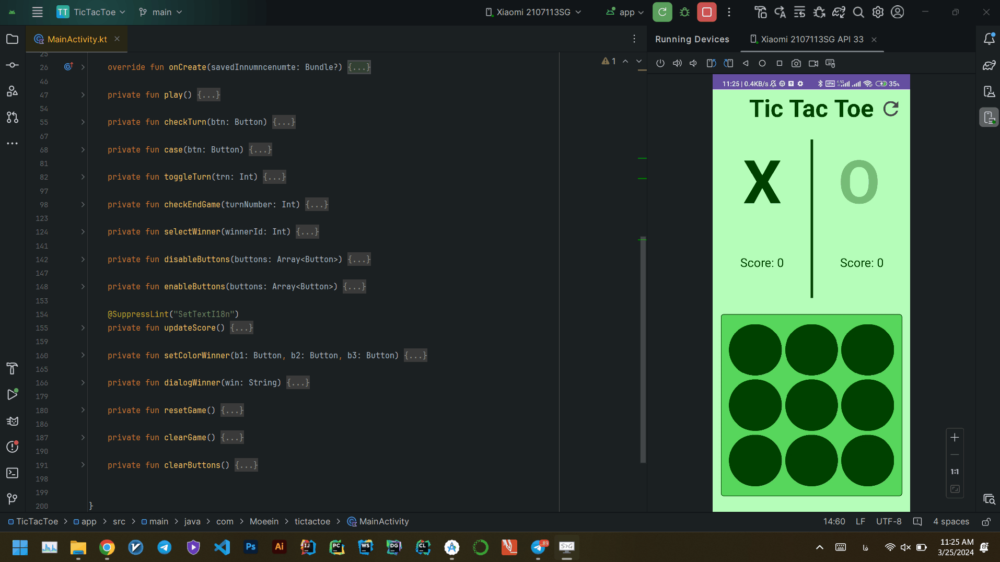

# Assignment05 - Question01 - Part02

### Methods

1. `onCreate(savedInnumncenumte: Bundle?)`: Called when the activity is first created, initializes the game board, sets
   up UI components, and assigns click listeners to buttons.

2. `play()`: Assigns click listeners to each button on the game board.

3. `checkTurn(btn: Button)`: Checks whose turn it is (X or O) and updates the game board accordingly when a button is
   clicked.

4. `case(btn: Button)`: Updates the internal game state based on which button is clicked.

5. `toggleTurn(trn: Int)`: Switches the turn between X and O after a move is made.

6. `checkEndGame(turnNumber: Int)`: Checks if there is a winner or if the game is a draw after each move.

7. `selectWinner(winnerId: Int)`: Handles actions when a player wins the game.

8. `disableButtons(buttons: Array<Button>)`: Disables buttons on the game board.

9. `enableButtons(buttons: Array<Button>)`: Enables buttons on the game board.

10. `updateScore()`: Updates displayed scores for each player.

11. `setColorWinner(b1: Button, b2: Button, b3: Button)`: Changes text color of the winning combination to indicate the
    winning sequence.

12. `dialogWinner(win: String)`: Displays a dialog box announcing the winner of the game.

13. `resetGame()`: Resets the game board and toggles the turn back to Player X.

14. `clearGame()`: Resets the internal game state.

15. `clearButtons()`: Clears text of all buttons on the game board.

### Variables

1. `binding`: An instance of the `ActivityMainBinding` class representing the binding between the activity and its
   layout.

2. `game`: A 2D array representing the state of the Tic Tac Toe game board.

3. `buttons`: An array containing references to all buttons on the game board.

4. `scoreX`: An integer representing the score of Player X.

5. `scoreO`: An integer representing the score of Player O.

6. `turn`: An integer representing whose turn it is (1 for X, 2 for O).

## Codes ~ Kotlin & XML

- [Kotlin Codes](TicTacToe\app\src\main\java\com\Moeein\tictactoe\MainActivity.kt)
- [XML Codes](TicTacToe\app\src\main\res\layout\activity_main.xml)
